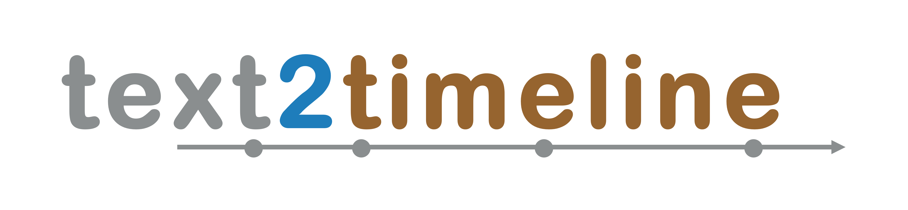

# text2timeline

A framework for the development of temporally aware models.



## Installation

The package is available on [PyPI]():

```shell
pip install text2timeline
```

It requires Python 3.8 or above.

## Usage

To understand its usability refer to the notebooks available [here]().


## Data

Throughout the last two decades many datasets have been developed to train this task.
text2timeline provides an easy interface to download the available corpus.

To know more about the module run the following code on the terminal.
```shell
python -m text2timeline download --help
```

## How To ...

In this section we summarize how to perform the most useful operations in text2timeline.

### download a dataset
```python
from text2timeline.datasets import download


```

## Contributing

1. Fork it (https://github.com/hmosousa/text2timeline)
2. Create your feature branch (`git checkout -b feature/fooBar`)
3. Commit your changes (`git commit -am 'Add some fooBar'`)
4. Push to the branch (`git push origin feature/fooBar`)
5. Create a new Pull Request

## Meta

Hugo Sousa - hugo.o.sousa@inesctec.pt

This framework is part of the [Text2Story](https://text2story.inesctec.pt/) project which is financed by the ERDF – European Regional Development Fund through the North Portugal Regional Operational Programme (NORTE 2020), under the PORTUGAL 2020 and by National Funds through the Portuguese funding agency, FCT - Fundação para a Ciência e a Tecnologia within project PTDC/CCI-COM/31857/2017 (NORTE-01-0145-FEDER-03185) 